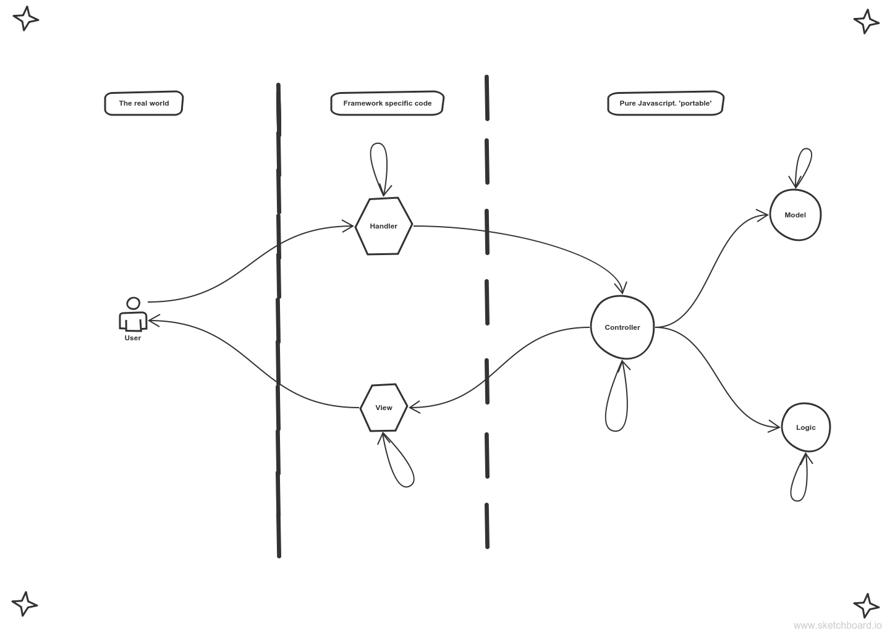

# MVC-LH

> SEPARATION OF CONCERNS

One of, if not __the most__, fundamental principle of software design.

"Separation of concerns" means that each file, each piece of code, has one simple and well defined purpose.  In this project you will be exploring the separation of user interface (view & handler) from core the application (controller, model, logic).  You will build a basic calculator object then use that same object to take arguments from the terminal and the browser.  The concerns are:
* _Model_:  controles access to application data
* _View_: displays to the user interface
* _Controller_: executes user stories by calling model & logic
* _Logic_: stores pure functions used to manipulate application state
* _Handler_: reads & validates user input then calls controller methods

Understanding this principle will help with testing, development scheduling, collaboration, maintenance, ... _everything_. In our experience, understanding separation of concerns is among the most important thing a new developer can master.  Far more important than learning new libraries, powerful devtools, or even being good at solving programming challenges.  

#### Table of Contents 
* [Prerequisite Knowledge](#prerequiste-knowledge)  
* [A Diagram](#a-diagram)  
* [A Checklist](#a-checklist)  
* [A Chart](#a-chart) 
* [An Example](#an-example)  

____________

## Prerequisite knowledge:
* __Separation of concerns__ : 
  * WHY -  
    * makes your code easier to understand, extend and debug
  * HOW - 
    * by organizing your code based on what it does and where it runs
    * by using objects to keep code organized 
        * careful!  this is not object oriented programming, just organization
    * by having the least possible interactions between objects
  * WHAT - 
    * MVC-LH architecture

[TOP](#table-of-contents)

___

## A Diagram

Each shape represents an object in your program.  The arrows show which objects are allowed to call which other objects (objects can use 'this' to call themselves). What you should notice is that there is a one-directional flow from the user event (handler) to a change in the UI (view).

This is because your app is __event driven__.  It sits idle until the user prompts it to change.  After a user triggers an event, tha event is set in motion, triggering a series function calls ending in a _state change_ (new data in memory) --> 
1. The handler recieves and parses the user's action, passing cleaned input values to the controller object.
2. The controller retrieves the application state from the model. 
3. Passing the state and user input as arguments, the controller asks the logic to decide what changes are necessary.  The logic returns the new application state.
4. The controller saves the new state to the model.
5. The controller calls the view with whatever data is needed to redraw the UI.

Component Details:
* Model: Object with methods & properties to store and protect data
* View: Object with methods for drawing to the UI
* Controller: Object with methods for use cases & properties for Model, Logic, View
* Logic: Object with pure function methods
* Handler: Object with event-driven UI listeners, calls Controller

[TOP](#table-of-contents) 

___

## A Checklist

Use this checklist to grade your own project.  
If your objects do anything that is not on this list your code is probably wrong.

| __M__  	|   __V__	| __C__  	| __L__  	|  __H__   	|
|:---:	|:---:	|:---:	|:---:	|:---:	|
|   saves data 	|   draws to the UI	|   calls the M, V, L	|   takes in app state	| listens to events   	|
|   returns data	|   	|   use temporary variables	|   makes decisions	|   cleans user data	|
|   	|   	|  	|   returns new app state 	|   passes it to controller	|
| --- | --- | --- | --- | --- |
| can call itself | can call the UI | can call M, L, V | can call itself | can call controller| 

[TOP](#table-of-contents)

___

## A Chart 

See how this architecture makes your life easy, you only have to change the L and H to run your project in different environments.

|   |   __M__	|  __V__   	| __C__  	|   __L__	|  __H__ 	|   
|:---:  |:---:	|:---:	|:---:	|:---:	|:---:	|
|   Terminal   |    js 	|   console.log	|   js	|   js	|   process.argv	|
|   Browser    |  js 	|   DOM stuff	|   js	|   js	|   events	|
|   Node webapp    |   js	|   res.send	|   js	|   js	|   Express Routes	|

[TOP](#table-of-contents)

___  

## Articles  
  
[this is about layers](http://www.edave.net/2011/03/22/a-layered-node-js-architecture-using-express/)    

___
___
### <a href="http://janke-learning.org" target="_blank"></img> Janke Learning</a>
